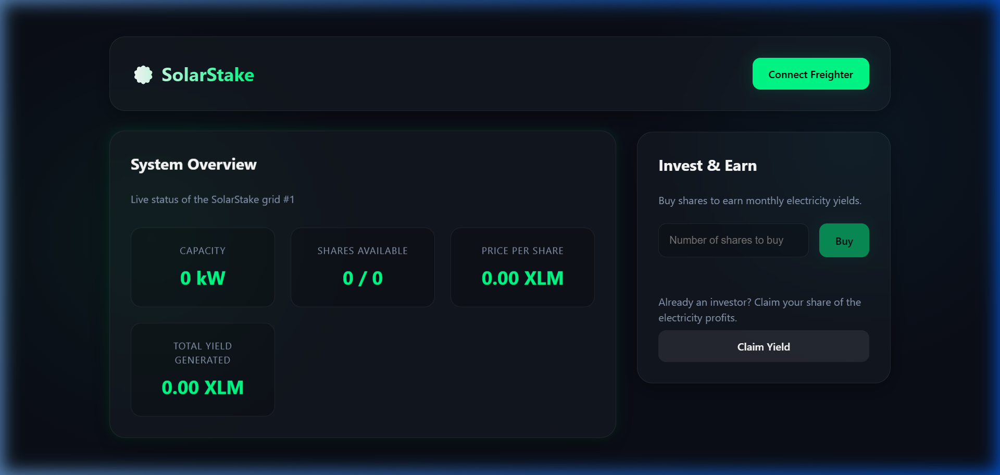

# SolarStake

## Project Title
SolarStake — Fractional Solar Energy Ownership on Stellar

## Problem
Installing rooftop solar panels costs $5,000–$10,000 upfront — too expensive for most individuals. Meanwhile, millions of people want to invest in clean energy but have no affordable way to participate.

## Solution
SolarStake tokenizes real-world solar panel systems into affordable micro-shares on the Stellar blockchain. Anyone can buy fractional ownership with XLM and automatically earn monthly yields from electricity sales — all enforced by a trustless smart contract.

## Why Stellar
Stellar's near-zero transaction fees (~$0.000003) make micro-investments economically viable. Soroban smart contracts enable automated, transparent dividend distribution without intermediaries. Traditional investment platforms charge 1–5% management fees — SolarStake charges nothing.

## Project Vision
The vision of SolarStake is to democratize access to green energy investments globally. By breaking down expensive solar installations into affordable blockchain-based shares, we empower individuals to contribute to renewable energy adoption while earning passive income — creating a decentralized solar cooperative for the future.

## Target User
- Retail investors seeking affordable green energy exposure
- Solar panel owners looking for decentralized crowdfunding
- ESG-focused communities and micro-investment clubs

## Key Features
- **Fractional Ownership:** Divide solar systems worth thousands into affordable shares purchasable with XLM.
- **Automated Yield Distribution:** Project owners deposit electricity profits; the smart contract distributes proportionally to all shareholders.
- **Transparent On-Chain Records:** All investments, share balances, and yield claims are permanently recorded on Stellar.
- **Trustless Execution:** Smart contract guarantees fair yield calculation — no middleman required.
- **Typed Error Handling:** Uses `#[contracterror]` for clear, client-friendly error messages.
- **TTL Management:** All storage entries have proper Time-To-Live extensions following Soroban best practices.

## Usage Instructions
1. **Connect Wallet:** Install Freighter extension, switch to Testnet, and connect your wallet.
2. **View Dashboard:** Check the solar project's live stats — capacity, available shares, price, and total yield.
3. **Buy Shares:** Enter the number of shares and sign the transaction via Freighter.
4. **Claim Yield:** When the owner distributes electricity profits, click "Claim Yield" to receive your proportional share.
5. **Query On-Chain:** Anyone can read project details and investor records transparently.

## Live Demo
- **Network**: Stellar Testnet
- **Contract ID**: `CDAQZDIIWIRIJ26PK7PRDOGBSDI2RFEEPI5BTFEPR3KYITRR44YOUI7E`
- **Explorer**: https://stellar.expert/explorer/testnet/contract/CDAQZDIIWIRIJ26PK7PRDOGBSDI2RFEEPI5BTFEPR3KYITRR44YOUI7E

## How to Run

### Smart Contract
```bash
cd contracts/solar_stake
stellar contract build
cargo test
```

### Frontend
```bash
cd frontend
npm install
npm run dev
```
Open `http://localhost:5173` in your browser with Freighter on Testnet.

## Future Scope
- **IoT Integration:** Connect solar inverters via Oracles for automated real-time yield distribution based on actual kWh produced.
- **Secondary Market:** Enable peer-to-peer trading of solar shares on a decentralized exchange.
- **Multi-Project Support:** Scale to support thousands of green energy projects globally.
- **Carbon Credit Tokenization:** Issue additional carbon offset tokens to shareholders.
- **Payment Integration:** Integrate Soroban token transfers for actual XLM payments on share purchases.

## Technology Stack
- **Smart Contract:** Rust and Soroban SDK v25 for secure, high-performance execution.
- **Blockchain:** Stellar Testnet for decentralized, fast, and low-cost state management.
- **Frontend:** React.js (Vite) with Vanilla CSS (Glassmorphism dark theme).
- **Wallet:** Freighter browser extension via `@stellar/freighter-api`.
- **SDK:** `@stellar/stellar-sdk` for contract interaction.

## Contribution
Community contributions are welcomed from blockchain developers, IoT engineers, and green energy advocates. Fork this repository and submit pull requests to assist in further development.

## License
This project is licensed under the MIT License.

### Contract Detail
ID: CDAQZDIIWIRIJ26PK7PRDOGBSDI2RFEEPI5BTFEPR3KYITRR44YOUI7E

